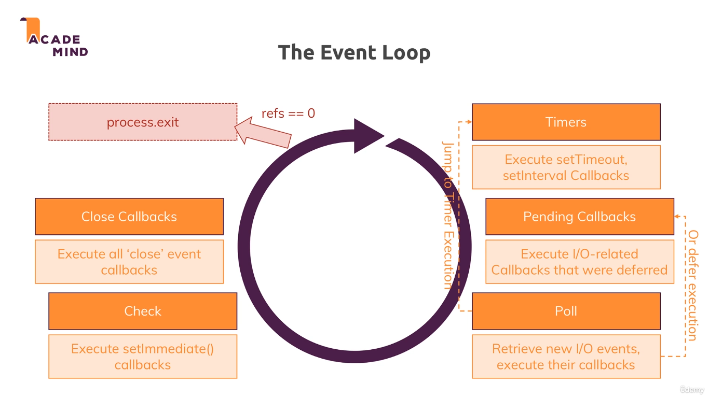
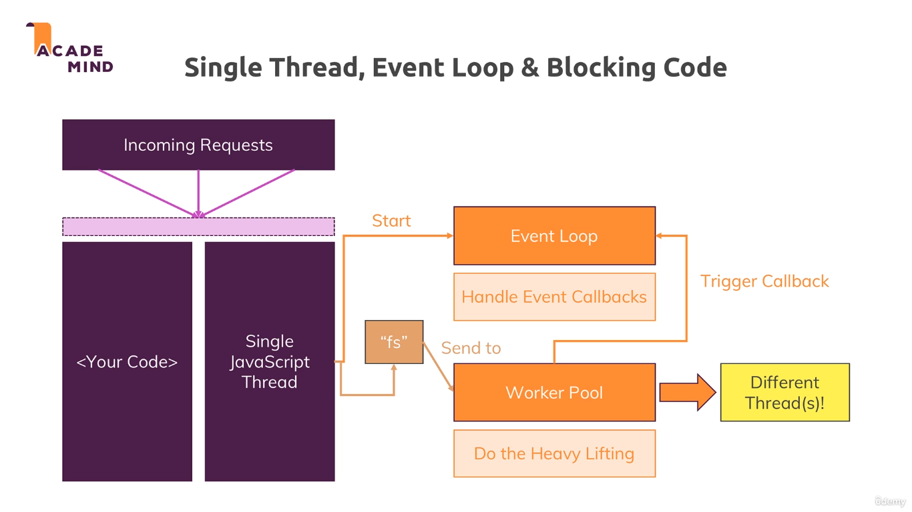

# Creating a Web Server

1. Core Modules

   - http - launch a server, send requests
   - https
   - fs
   - path
   - os

2. [HTTP Headers in detail](https://developer.mozilla.org/en-US/docs/Web/HTTP/Headers)

3. Understand Event Loops
   
   

4. Useful resources:

   - Official Node.js Docs: https://nodejs.org/en/docs/guides/

   - Full Node.js Reference (for all core modules): https://nodejs.org/dist/latest/docs/api/

   - More about the Node.js Event Loop: https://nodejs.org/en/docs/guides/event-loop-timers-and-nexttick/

   - Blocking and Non-Blocking Code: https://nodejs.org/en/docs/guides/dont-block-the-event-loop/
