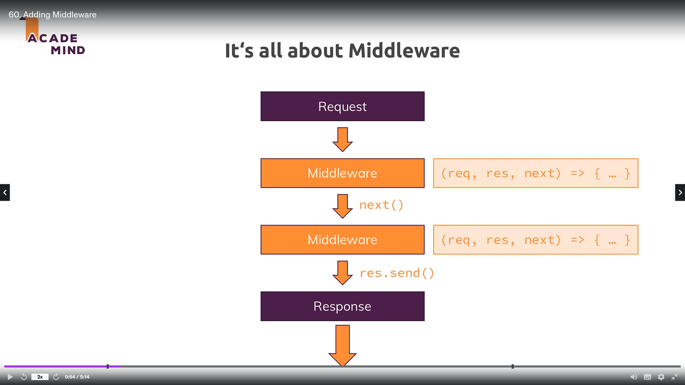

# Express JS

## Middleware



## Project

    - How to start the project
      ```
        npm start
      ```
    - How to debug the project
      - add **debugger** anywhere in the code and use **repl** to debug the code
      ```
        npm run debug
      ```

1. Express NPM Package

   - [Package Link](https://github.com/expressjs/express/tree/master)
   - **lib** folder => **response.js** file (_line 103_)
   - **lib** folder => **application.js** file (_line 615_)
   - [Documentation Link](https://expressjs.com/en/4x)

2. Get root directory path

   - This method is not available in **module** type

   ```
     module.exports = path.dirname(require.main.filename);
     module.exports = path.dirname(process.mainModule.filename);
   ```
