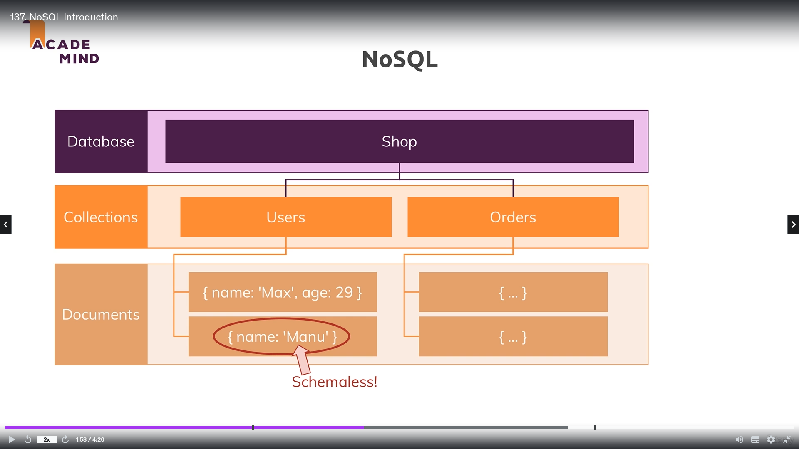
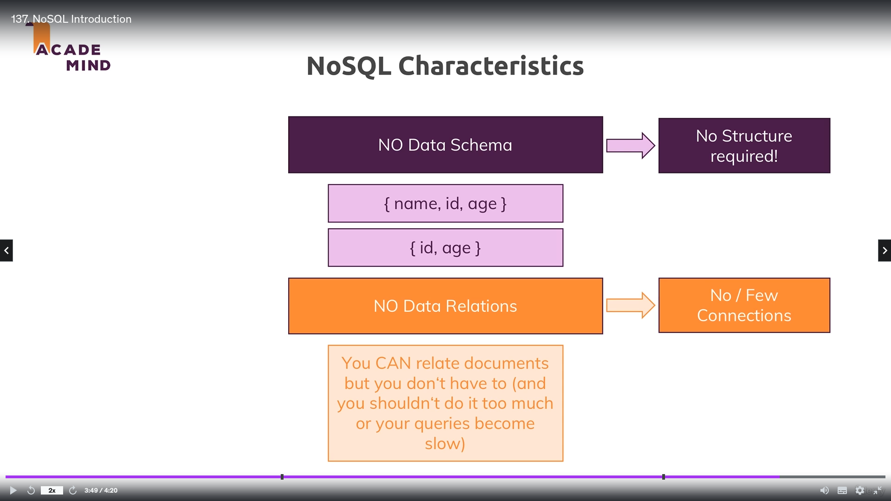
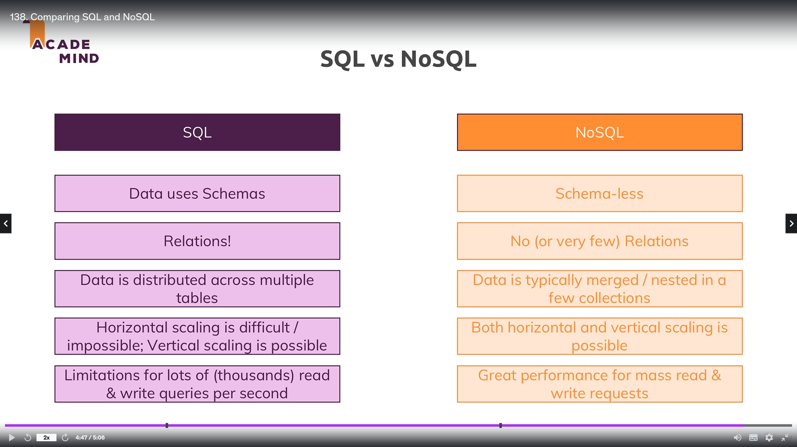

# Databases SQL (MySQL with Sequelize)

1. No SQL
   

   - Characteristics
     

2. SQL vs NoSQL
   

3. MySQL (Server(Docker) & [Workbench](https://dev.mysql.com/downloads/workbench/))

   ```
      # MySQL
      docker pull mysql:8.0.32
      docker run -e MYSQL_ROOT_PASSWORD=password -p 3306:3306 --name mysql -d mysql:8.0.32

      # Enter the running container
      docker exec -it mysql bash
      mysql -u rool -p
      CREATE DATABASE node_practice;
      USE node_practice;
   ```

   - NPM package [mysql2](https://github.com/sidorares/node-mysql2)

4. NPM Package [sequelize](https://github.com/sequelize/sequelize)

   - Used this pacakge to focus on coding and work seamlessly with DB
   - **Relationships** are defined in file _db/relationships.js_
   - [Documentation](http://docs.sequelizejs.com/)

5. Use of seeds command to populate dummy data in the db
   - **File:** db/seeds
   - command
     ```
        npm run db:seed
     ```
