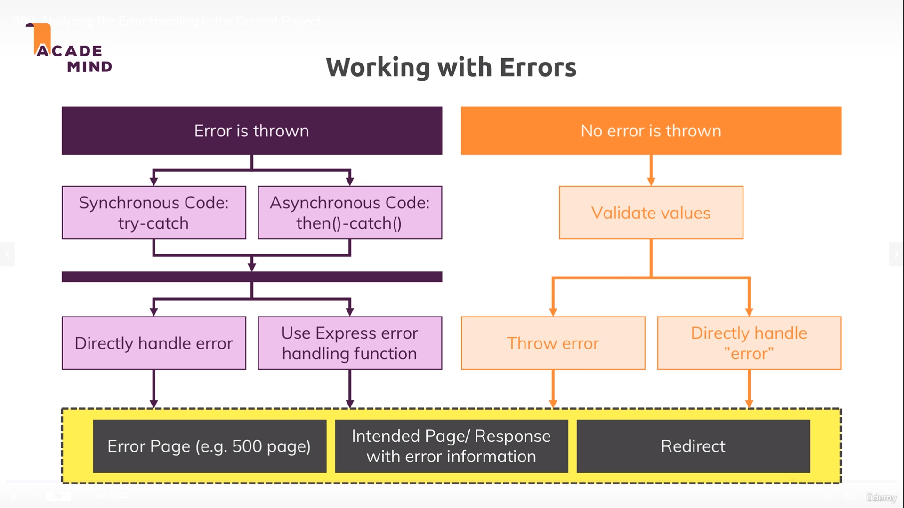
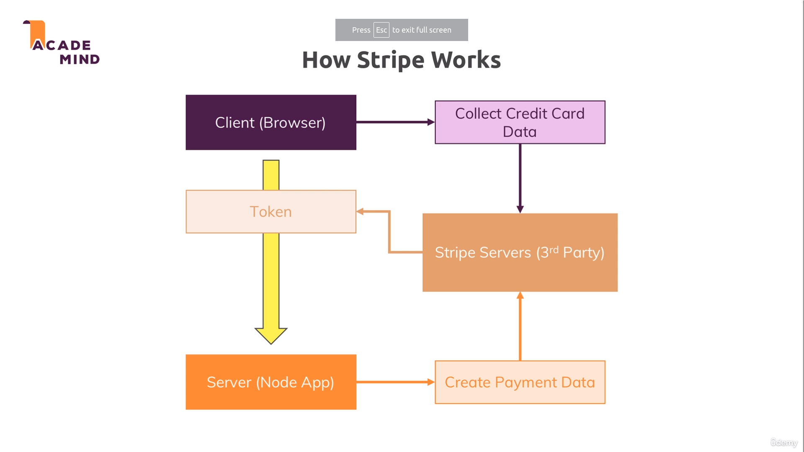

# Session, Cookies & Authentication

1. [Session Store](https://github.com/expressjs/session): we are using [Mongodb session store](https://www.npmjs.com/package/connect-mongodb-session)

2. [Sessions](https://www.quora.com/What-is-a-session-in-a-Web-Application)

3. [Cookies](https://developer.mozilla.org/en-US/docs/Web/HTTP/Cookies)

4. [Express-session](https://github.com/expressjs/session)

5. Different ways of chaining routes check **Controllers** all route or **Routes.ts** file for _AuthRouter_

6. [csurf](https://www.npmjs.com/package/csurf): It generates a hash token for every page rendered, which lets the server knows that request is coming from the genuine user interface

   - Alternatives due to deprecated package
   - [csrf-csrf](https://www.npmjs.com/package/csrf-csrf)
   - [More on CSRF attacks](https://www.acunetix.com/websitesecurity/csrf-attacks/)

7. [Bcrypt official docs](https://github.com/dcodeIO/bcrypt.js)

8. [Nodemailer](https://nodemailer.com/about/)

9. [Sendgrid](https://sendgrid.com/docs/)

10. [Express-Validator](https://express-validator.github.io/docs/)

    - [Sanitizing data](https://express-validator.github.io/docs/sanitization)
    - 

11. [Validator.js](https://github.com/chriso/validator.js) is used behind the scenes

12. Error Handling

    - 
    - 
    - [Status Codes](https://developer.mozilla.org/en-US/docs/Web/HTTP/Status)]
    - [Express Docs](https://expressjs.com/en/guide/error-handling.html) for error handling

13. File Upload & Download

    - [Upload](https://www.npmjs.com/package/multer) with multer
    - Download
      - Simple Read and send
      - Stream Read and send
      - Use [PdfKit](https://www.npmjs.com/package/pdfkit) to generate PDF on the fly
    - Useful resources:
      - [Multer Official Docs:](https://github.com/expressjs/multer)
      - [Streaming Files:](https://medium.freecodecamp.org/node-js-streams-everything-you-need-to-know-c9141306be93
      - [Generating PDFs with PDFKit](http://pdfkit.org/docs/getting_started.html)

14. Asynchronous requesthttps://stripe.com/docshttps://stripe.com/docshttps://stripe.com/docshttps://stripe.com/docs

    - [More on the fetch API: ](https://developers.google.com/web/updates/2015/03/introduction-to-fetch)
    - [More on AJAX Requests: ](https://developer.mozilla.org/en-US/docs/Web/Guide/AJAX/Getting_Started)

15. Payment Integration with [Stripe](https://stripe.com/docs)
    - 
