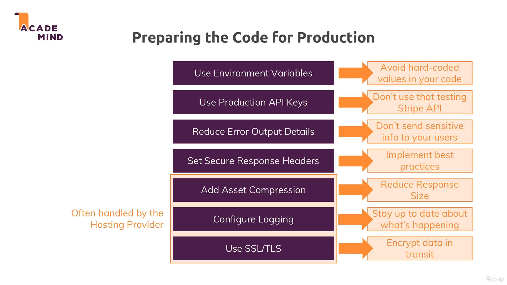
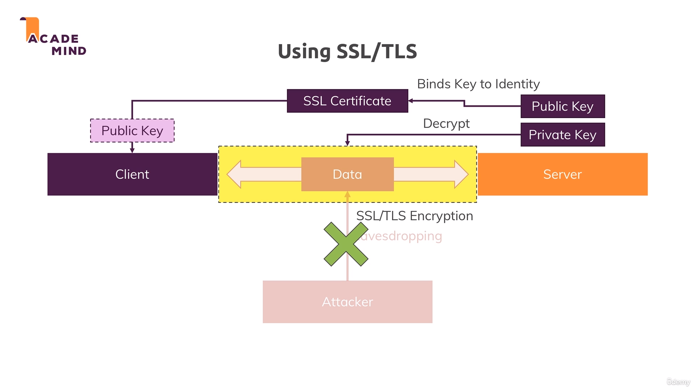
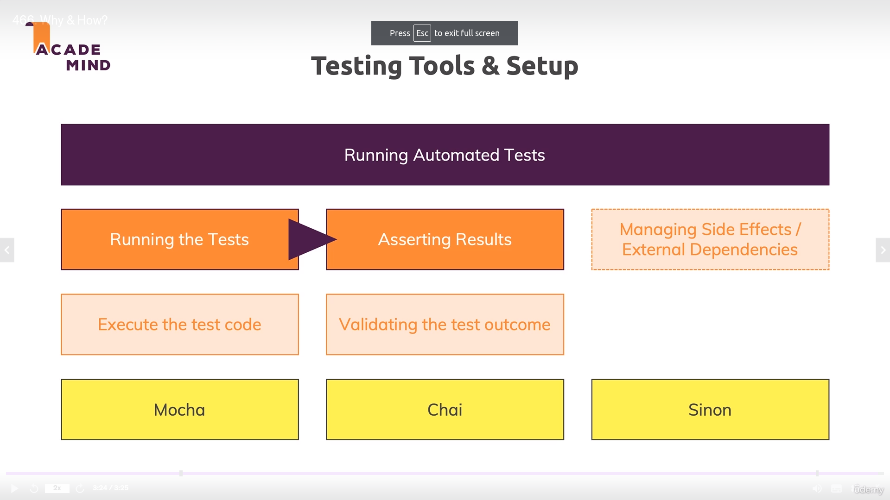
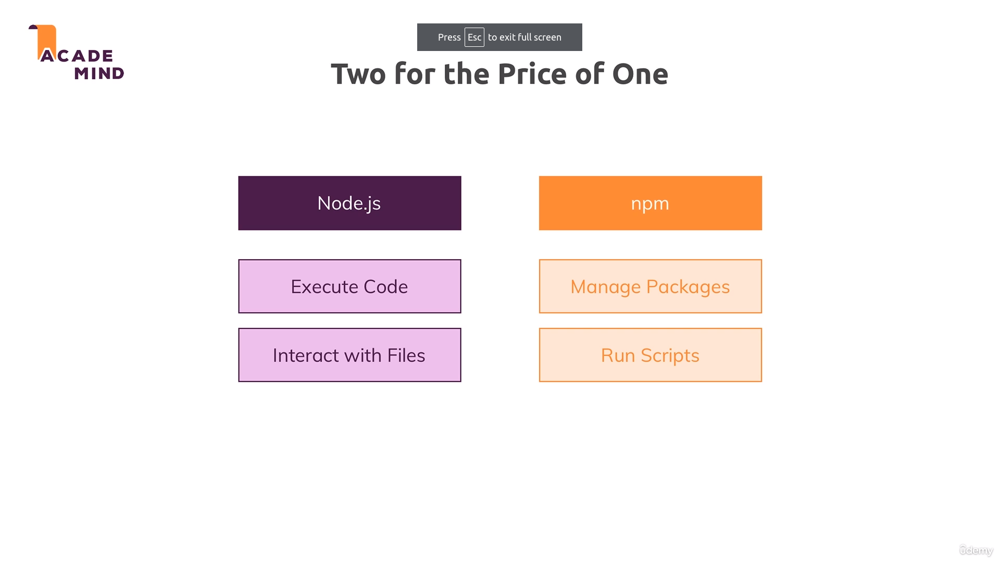
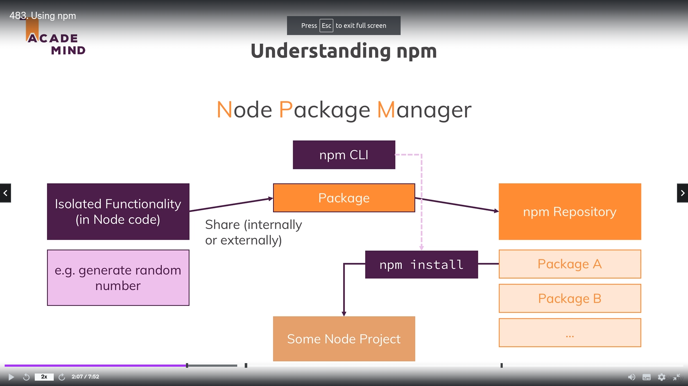
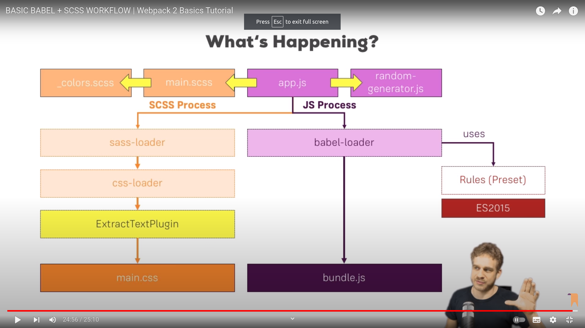

# Master Node JS & Deno.js, build REST APIs with Node.js, GraphQL APIs, add Authentication, use MongoDB, SQL & much more!

- Last but not least - I tweet on @maxedapps and on @academind_real, would love to see you there!
- [Academind](https://academind.com/)

## 02 Creating a NODE Server (02 Understanding Basics)

    - [Readme](./02_Understanding_basics/readme.md)

## 03 Improved Development and debugging

    - [Readme](./03_improved_development_workflow_and_debugging/readme.md)

## 04 Working with Express.JS

## 05 Working with Dynamic Content & Adding Template Engines

## 06 The Model View Controller (MVC) (Section 7, 8, 9) in **06_mvc** folder

## 07, 08, 09 Databases (Sql and No-Sql) (Section 10, 11, 12, 13) in **07_databases** folder

## 10 Sessions, Cookies, Authentication

## 11 REST APIs

## 12 GraphQL

## 13 Deployment

- 
- Secure headers with [Helmet](https://www.npmjs.com/package/helmet)
- [Compression](https://www.npmjs.com/package/compression) to compress assets to make application lightweight and faster
- [Morgan](https://www.npmjs.com/package/morgan) to request logging on production
  ```
      const accessLogStream = fs.createWriteStream(file, {flags: 'a'})
      app.use(morgan('combined'), {stream: accessLogStream})
  ```
  - [More on Logging](https://blog.risingstack.com/node-js-logging-tutorial/)
- SSL/TLS
  - 
  - Use of _OPENSSL_ on development server to test SSL/TLS but on production, should take certificate for registered authorities
  - [Link](https://medium.com/internshala-tech/adding-self-trusted-ssl-certificate-for-localhost-on-ubuntu-nginx-c66d70b22e4b)
    ```
        https.createServer({key: key, cert: cert}, app).listen(3000)
    ```
- [Heroku](https://www.heroku.com/)
  - Use of Heroku git to push the code
  - in Settings => Config vars (Add your env variables)
- Cloud Storage
  - A popular and very efficient + affordable alternative is AWS S3 (Simple Storage Service): https://aws.amazon.com/s3/
  - You can easily configure multer to store your files there with the help of another package: https://www.npmjs.com/package/multer-s3
  - To also serve your files, you can use packages like s3-proxy: https://www.npmjs.com/package/s3-proxy
  - For deleting the files (or interacting with them on your own in general), you'd use the AWS SDK: https://aws.amazon.com/sdk-for-node-js/
- Useful Links
  - Herokus Docs: https://devcenter.heroku.com/categories/reference
  - Deploying SPAs (like our React App): https://medium.com/@baphemot/understanding-react-deployment-5a717d4378fd
  - Alternative Hosting Providers:
    - Amazon Web Services: https://aws.amazon.com/getting-started/projects/deploy-nodejs-web-app/
    - DigitalOcean: https://www.digitalocean.com/community/tutorials/how-to-set-up-a-node-js-application-for-production-on-ubuntu-16-04

## 14 Testing (done in REST APIs)

- 

## 15 Node.js as a Build Tool & Using NPM

- 
- 
- Docs
  - [Learn about available versions annotations](https://docs.npmjs.com/misc/semver#versions)
  - [Stackoverflow Post](https://stackoverflow.com/a/25861938)
- Build Tool
  - [Official npm Docs](https://docs.npmjs.com/)
  - Learn more about [Webpack](https://academind.com/learn/webpack) (a build tool using Node.js)
    - [Webpack Basics](https://academind.com/tutorials/webpack-2-the-basics)
      - Webpack
        - specify entry and output point
      - webpack-dev-server
        - wrapper around webpack which watch changes and build on the fly and store output file in memory server
      - webpack.config.js
        - entry
        - output: {path: path.resolve(\_\_dirname, 'dist'), filename:, publicPath: '/dist' }
        - module: {rules: [{test: /\.css$/, use: ['css-loader', 'style-loader']}]}
        - plugins: [new webpack.optimize.UglifyJsPlugin({})]
      - NPM packages
        - css-loader
        - style-loader
        - sass-loader
        - extract-text-webpack-plugin
        - babel-core
        - bable-loader
        - babel-preset-2015
      - 
      - [HTML + Image Loaders](https://www.youtube.com/watch?v=CzLiXgRUt4g)
      - [Webpack + Mutliple HTML files](https://www.youtube.com/watch?v=y_RFOaSDL8I)
      - Using 3rd party packages like jquery
