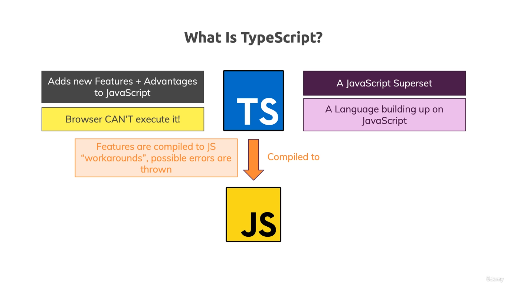
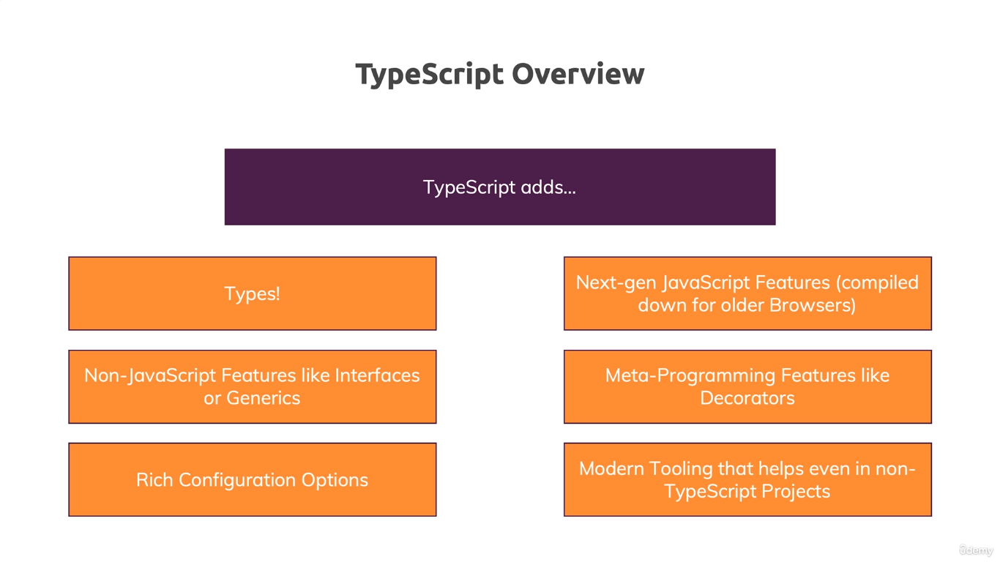
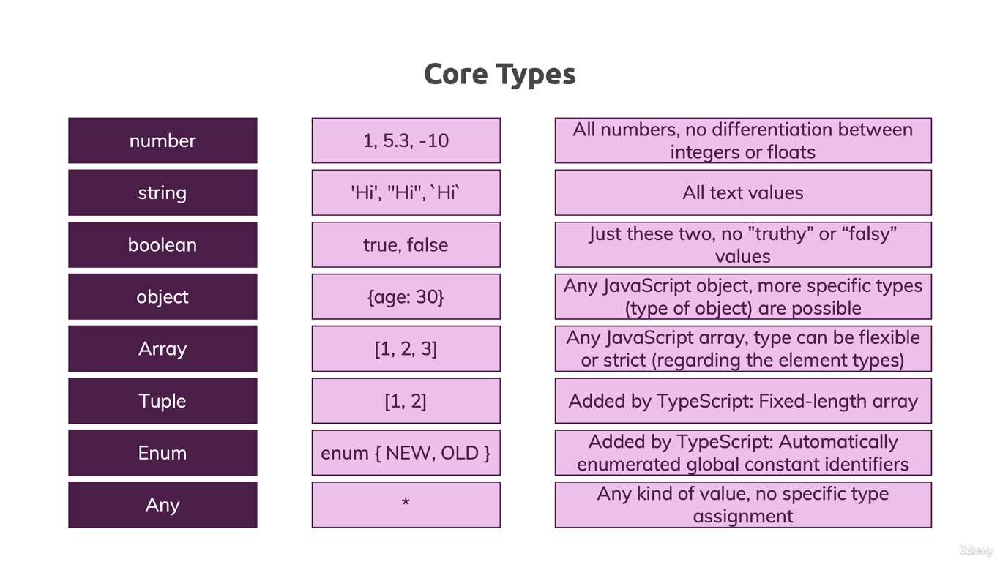
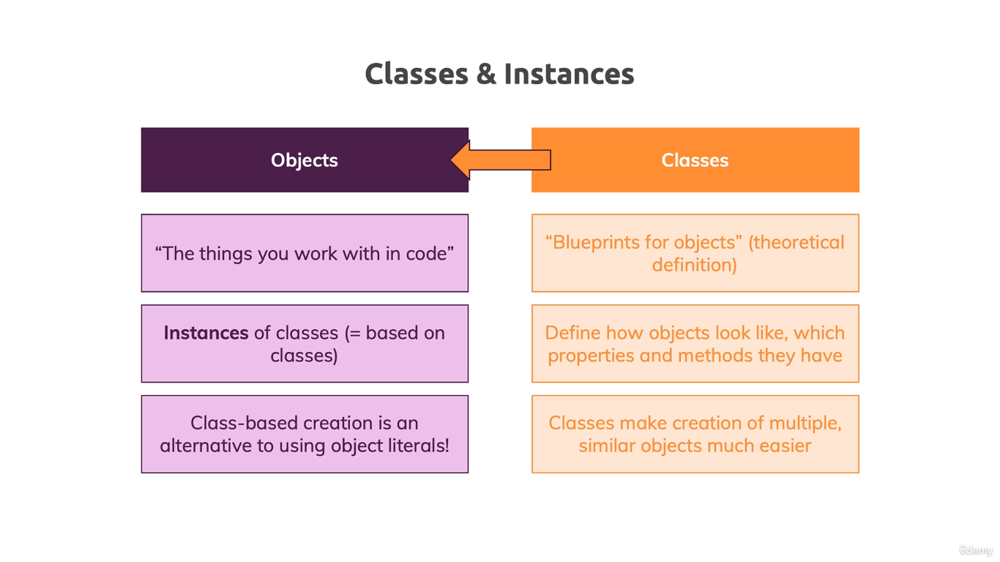

# Boost your JavaScript projects with TypeScript: Learn all about core types, generics, TypeScript + React or Node & more!

## What is typescript



### Typescript Overview



### TS Core Types

The core primitive types in TypeScript are all lowercase!


### Course Overview


### 01 Getting Started

1. Install **lite-server** to run the app continuously by watching file changes

   - Create a file

     ```
     echo {} >> bs-config.json
     ```

   - Add below content to above json file

     ```
     "port": 3000,
       "files": ["./01_Getting_Started/**/*.{html,htm,css,js}"],
       "server": { "baseDir": "./01_Getting_Started" }
     ```

   - TSC Init to avoid re-declaration errors

     ```
       tsc --init
     ```

   - How to run the project
     - on one terminal
     ```
        npm run
     ```
     - on another terminal (watch .ts files and compile them to .js files)
     ```
        tsc -w
     ```

## 02 Typescipt Basics & Basic Types

1. Install **ts-node-dev**, which helps in auto restarting target node

   ```
   yarn add ts-node-dev --dev
   ts-node-dev --respawn --transpile-only index.ts // OR # tsnd --respawn index.ts
   ```

2. [Official TypeScript Docs](https://www.typescriptlang.org/docs/handbook/2/everyday-types.html)

## 03 The Typescript Compiler (and it's configuration)

1. Adding watch mode to the files so that they compile automatically
   ```
     ts-node filename --watch // #ts-node filename -w
   ```
2. Understanding of certain keys in **tsconfig.json**
   - include
   - exclude
   - files
   - target: specify which ECMAScript version to include while compiling TS files
   - lib
   - allowJS
   - checkJS
   - sourceMap: allows you to see TS files in browser console as it generates a map files which is read by browser
   - rootDir
   - outDir
   - removeComments
   - noEmit: to check your compilation for potential errors but not creating a file
   - downlevelIteration: have loops and see that your code behaves differently than it should
   - outFile: to concatenate all files in a single JS file
   - noEmitOnError: to generate a JS file even if TS file have an error when stated as FALSE
   - strict: ensures working with correct data types
   - multiple strict type checkings: see the detail in tsconfig.json file
3. use Sourcemap: true in tsconfig to debug code
   - Run Debugging via chrome and update **lauch.json** file
4. Useful Links
   - [tsconfig Docs](https://www.typescriptlang.org/docs/handbook/tsconfig-json.html)
   - [Compiler Config Docs](https://www.typescriptlang.org/docs/handbook/compiler-options.html)
   - [VS Code TS Debugging](https://code.visualstudio.com/docs/typescript/typescript-debugging)

## 04 Next-generation javascript & Typescript

## 05 Classes and Interfaces

1. Classes VS Objects
   

2. [Ecmascript Compatibility Table](https://kangax.github.io/compat-table/es6/)
3. Use of

   - const: constant with fixed value
   - let: variable whose value could be changed in the function defined
   - var: variable whose value could be changed anywhere in the file

4. More Links

   - More on (JS) Classes: https://developer.mozilla.org/en-US/docs/Web/JavaScript/Reference/Classes

   - More on TS Interfaces: https://www.typescriptlang.org/docs/handbook/2/objects.html

## 06_Advanced Types

## 07_Generics

1. Module Content

   - Intersection types
   - Type Guards
   - Discriminated Unions
   - Type Casting
   - Function Overloads

2. [More on Generics](https://www.typescriptlang.org/docs/handbook/generics.html)

## 08_Decorators (Useful for Meta Programming)

1. Set _experimentalDecorators_ **true**
2. Import NPM package **class-validator**
3. [More on Decorators](https://www.typescriptlang.org/docs/handbook/decorators.html)

#### Notes

1. Shortcut of parseInt or parseFloat
   +num1 + +num2
2. Install [Typescript](https://www.npmjs.com/package/typescript)
3. Third party plugins in VS Code
   - ESLint
   - Material Icon Theme
   - Path Intellisense - autocomplete filenames
   - Prettier - Code formatter
   - Debugger for Chrome - Deprecated (use Sourcemap: true in tsconfig)
